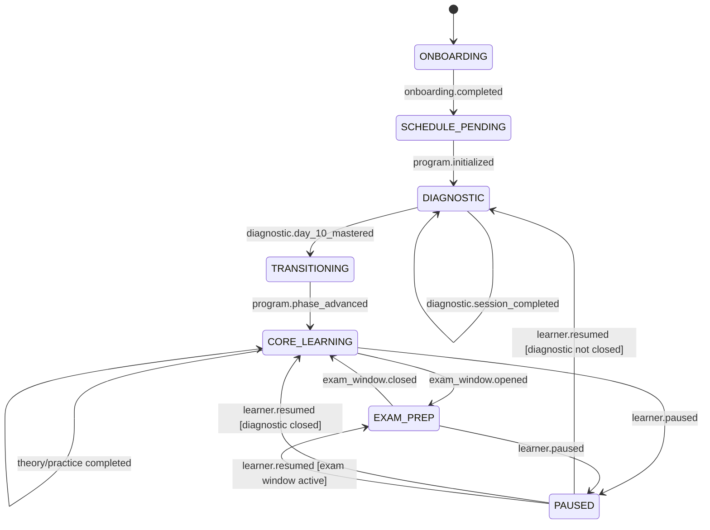

# Tawjeeh.ed Core Agent State Machine and Dynamic Scheduler

## 1. Purpose and architectural boundary

This document defines the runtime contract for the Tawjeeh.ed learning
orchestrator. It is intentionally independent of a particular LLM provider:
the agents may use an LLM for conversation and content generation, but phase
transitions, schedule mutations, penalties, and mastery decisions are
deterministic and auditable.

The **Program Agent is the scheduling authority**. Other agents may recommend
work, report outcomes, and request a schedule change, but they do not mutate
the canonical schedule directly.

```text
Student / Web App
       │ commands and learning evidence
       ▼
Event Gateway ──► Durable Agent Event Log
       │                    │
       │                    ▼
       │             Program Agent / Scheduler
       │                    │
       │        ┌───────────┴───────────┐
       ▼        ▼                       ▼
   Mascot   Faheem                  Daleel + Exercises
              │                         │
              └──────► mastery ◄────────┘
                         │
                         ▼
                 Mistake and progress store

Knowledge Base (read-only, source-grounded)
        ▲                    ▲
        └── Daleel ──────────┘
        └── Exercises ──────┘
```

### Invariants

1. There is one active learning phase per user.
2. Faheem (`فهيم`) can receive a learning-session command only while
   `phase = DIAGNOSTIC` and `diagnosticDay` is between 1 and 10.
3. Daleel (`دليل`) owns theory sessions after the diagnostic phase.
4. Exercises owns practice, quizzes, correction, and error-stack drills.
5. Only the Program Agent commits schedule changes.
6. Every command and event has an idempotency key. Retrying a request cannot
   double-penalize a student or create duplicate sessions.
7. A session has a start time but no fixed completion deadline. It completes
   only after the mastery validator accepts the required evidence.
8. All generated explanations and exercises must retain knowledge-base source
   references.

## 2. Agent network

| Agent | Arabic label | Activation | Responsibilities | Must not do |
| --- | --- | --- | --- | --- |
| Mascot | البومة الزرقاء | Onboarding and navigation | Welcome, explain the product, collect initial context, hand off to Program Agent | Schedule or grade |
| Program Agent | بومة البرنامج | Always | Build the plan, coordinate agents, apply penalties, shift sessions, send notifications, enforce phase gates | Teach or invent grades |
| Faheem | فهيم | Diagnostic days 1–10 only | Baseline concepts from the previous year, split-screen diagnostic teaching, mastery evidence | Run after the diagnostic phase is closed |
| Daleel | دليل | After diagnostic phase | Theory, voice teaching, whiteboard applications, grounded explanations | Create the canonical exercise score |
| Exercises | بومة التمارين/الامتحان | After diagnostic phase and when practice is scheduled | Generate practice and exams, correct work, track errors, run error stacks | Change the schedule without a Program Agent event |

After day 10, Daleel and Exercises are both active. They are not a strict
linear handoff: the Program Agent can interleave theory and practice, and
Exercises can request a Daleel remediation session when an error indicates a
conceptual gap.

## 3. User state machine



`TRANSITIONING` is a short, persisted state rather than an in-memory flag.
The Program Agent uses it to prevent a race in which a late Faheem request is
accepted while Daleel is being enabled.

### Transition guards

- `ONBOARDING → SCHEDULE_PENDING`: identity is authenticated and the student
  has supplied at least a timezone, available study windows, curriculum year,
  and expected exam date.
- `SCHEDULE_PENDING → DIAGNOSTIC`: a first schedule exists and the diagnostic
  curriculum has been selected.
- `DIAGNOSTIC → TRANSITIONING`: the tenth diagnostic day has a validated
  mastery result. An open session may finish after its nominal start day; the
  phase transition occurs only when that session is validated.
- `TRANSITIONING → CORE_LEARNING`: all diagnostic results and the first
  post-diagnostic plan have been committed in one transaction.
- Any agent command whose phase precondition fails is rejected with
  `STALE_PHASE`, not silently rerouted.

## 4. Canonical JSON data models

The following examples are canonical wire models. Dates are ISO 8601 strings;
all timestamps include an offset or `Z`; identifiers are opaque strings.
Unknown fields must be ignored when reading and preserved when forwarding.

### 4.1 User state

```json
{
  "userId": "usr_01J...",
  "timezone": "Africa/Algiers",
  "locale": "ar-DZ",
  "curriculum": {
    "country": "DZ",
    "schoolYear": "third_secondary",
    "subjects": ["physics", "mathematics"],
    "examDate": "2027-06-07"
  },
  "phase": "DIAGNOSTIC",
  "diagnostic": {
    "startedAt": "2026-09-11T18:30:00+01:00",
    "diagnosticDay": 4,
    "totalDays": 10,
    "status": "ACTIVE",
    "faheemEnabled": true,
    "masteredDays": [1, 2, 3],
    "pendingDays": [4]
  },
  "agentAvailability": {
    "mascot": "ACTIVE",
    "program": "ACTIVE",
    "faheem": "ACTIVE",
    "daleel": "INACTIVE",
    "exercises": "LIMITED"
  },
  "learning": {
    "weeklyExerciseMultiplier": 1,
    "weeklyMultiplierWeek": "2026-W37",
    "currentConceptIds": ["physics.motion.vectors"],
    "masteryThreshold": 0.7
  },
  "preferences": {
    "availableWindows": [
      {
        "weekday": 0,
        "start": "18:00",
        "end": "21:30"
      }
    ],
    "pushNotifications": true,
    "voiceTeaching": true
  },
  "version": 12,
  "updatedAt": "2026-09-14T20:12:04+01:00"
}
```

Allowed values:

- `phase`: `ONBOARDING`, `SCHEDULE_PENDING`, `DIAGNOSTIC`,
  `TRANSITIONING`, `CORE_LEARNING`, `EXAM_PREP`, `PAUSED`
- agent availability: `ACTIVE`, `LIMITED`, `INACTIVE`
- diagnostic status: `ACTIVE`, `COMPLETED`, `PAUSED`

`weeklyExerciseMultiplier` is normally `1` or `2`. Repeated misses in one ISO
week are idempotently coalesced to `2`, rather than causing accidental
exponential growth. A future product policy can explicitly permit `4`, but it
must be a named policy and not an emergent retry behavior.

### 4.2 Agent communication event

```json
{
  "eventId": "evt_01J...",
  "eventType": "SESSION_OUTCOME_RECORDED",
  "occurredAt": "2026-09-14T20:12:04+01:00",
  "actor": {
    "kind": "agent",
    "id": "exercises",
    "version": "1"
  },
  "userId": "usr_01J...",
  "sessionId": "ses_01J...",
  "correlationId": "corr_01J...",
  "causationId": "evt_01J_previous",
  "idempotencyKey": "session-outcome:ses_01J...:attempt-1",
  "phase": "CORE_LEARNING",
  "payload": {
    "outcome": "UNDERPERFORMED",
    "score": 42,
    "mastery": 0.42,
    "requiredMastery": 0.7,
    "conceptIds": ["physics.motion.vectors"],
    "mistakeIds": ["mist_01J..."]
  },
  "routing": {
    "targetAgent": "program",
    "priority": "HIGH"
  }
}
```

Recommended event types:

```text
ONBOARDING_COMPLETED
SCHEDULE_INITIALIZED
SESSION_STARTED
SESSION_HEARTBEAT
MASTERY_EVIDENCE_SUBMITTED
SESSION_COMPLETED
SESSION_SKIPPED
SESSION_MISSED
SESSION_OUTCOME_RECORDED
QUIZ_SUBMITTED
MISTAKE_RECORDED
DIAGNOSTIC_DAY_COMPLETED
DIAGNOSTIC_PHASE_COMPLETED
SCHEDULE_SHIFT_REQUESTED
PENALTY_APPLIED
VOLUME_MULTIPLIER_APPLIED
PHASE_CHANGED
NOTIFICATION_REQUESTED
```

Events are append-only. A consumer stores `(consumerName, idempotencyKey)`
before applying a side effect, in the same transaction as that side effect.
The event payload is immutable; corrections are represented by a new event.

### 4.3 Schedule object

```json
{
  "scheduleId": "sch_01J...",
  "userId": "usr_01J...",
  "weekKey": "2026-W37",
  "phase": "CORE_LEARNING",
  "status": "PLANNED",
  "entries": [
    {
      "entryId": "ent_01J...",
      "sequence": 18,
      "agent": "daleel",
      "kind": "THEORY",
      "title": "الحركة المستقيمة",
      "subject": "physics",
      "conceptIds": ["physics.motion.vectors"],
      "plannedStart": "2026-09-15T18:00:00+01:00",
      "startedAt": null,
      "masteredAt": null,
      "endsAt": null,
      "mastery": {
        "required": 0.7,
        "current": 0.0,
        "status": "NOT_STARTED"
      },
      "status": "PENDING",
      "originalEntryId": "ent_01J_original",
      "shift": {
        "isCompensation": true,
        "reason": "MISSED_THEORY",
        "sourceEntryId": "ent_01J_missed",
        "shiftChainId": "shift_01J..."
      },
      "volumeMultiplier": 1,
      "notification": {
        "enabled": true,
        "lastSentAt": null
      }
    }
  ],
  "revision": 9,
  "generatedBy": "program",
  "generatedAt": "2026-09-14T20:12:04+01:00"
}
```

Allowed entry values:

- `kind`: `ONBOARDING`, `DIAGNOSTIC`, `THEORY`, `PRACTICE`, `QUIZ`,
  `ERROR_STACK`, `REVIEW`, `EXAM`
- `status`: `PENDING`, `ACTIVE`, `PAUSED`, `MASTERED`, `SKIPPED`, `MISSED`,
  `CANCELLED`
- `endsAt` is `null` until mastery is validated. `plannedStart` is the
  notification/start anchor, not a forced end time.

### 4.4 Mistake tracking

```json
{
  "mistakeId": "mist_01J...",
  "userId": "usr_01J...",
  "conceptId": "physics.motion.vectors",
  "skillId": "vector_decomposition",
  "source": {
    "kind": "QUIZ",
    "sessionId": "ses_01J...",
    "questionId": "q_17",
    "attemptId": "att_01J..."
  },
  "classification": {
    "type": "CONCEPTUAL",
    "severity": "HIGH",
    "misconception": "خلط بين المركبة الأفقية والسرعة الكلية",
    "confidence": 0.91
  },
  "evidence": {
    "studentAnswer": "v = vx + vy",
    "expectedAnswer": "v² = vx² + vy²",
    "sourceNodeIds": ["node_physics_442"],
    "sourcePages": [37]
  },
  "state": {
    "status": "OPEN",
    "occurrences": 3,
    "firstSeenAt": "2026-09-14T19:22:00+01:00",
    "lastSeenAt": "2026-09-14T20:12:04+01:00",
    "nextReviewAt": "2026-09-15T18:00:00+01:00",
    "masteryAttempts": 0,
    "requiredConsecutiveCorrect": 2
  },
  "stack": {
    "stackId": "stack_01J...",
    "rank": 1,
    "includedInNextPractice": true
  },
  "updatedAt": "2026-09-14T20:12:04+01:00"
}
```

Mistake states are `OPEN`, `IN_REMEDIATION`, `STABILIZED`, and `RESOLVED`.
The Exercises Agent selects open mistakes by severity, recency, recurrence,
and concept prerequisite order. A mistake is resolved only after the required
number of spaced, independent correct attempts; one correct answer cannot
erase an error.

## 5. Dynamic scheduler

### Inputs

The scheduler recomputes from the canonical state, not from UI-local state:

- entry time and timezone;
- available study windows;
- curriculum and concept prerequisites;
- exam, quiz, homework, and research dates;
- phase and agent availability;
- mastery evidence and open mistakes;
- attendance: completed, active, skipped, and missed sessions;
- the weekly volume multiplier;
- existing schedule revision and shift chains.

### Session lifecycle

```text
PENDING → ACTIVE → MASTERED
       ↘ PAUSED ↗
       ↘ SKIPPED
       ↘ MISSED
```

- `ACTIVE` is entered at or after `plannedStart` when the student opens the
  session.
- `PAUSED` preserves the current teaching context and can return to `ACTIVE`.
- `MASTERED` is emitted only by the mastery validator.
- `MISSED` is assigned by the attendance worker after the configured grace
  window, or immediately for an explicit skip.
- No timer automatically marks an active session complete.

### Compensation rule: missed theory

When a theory entry becomes `MISSED`:

1. The event gateway emits exactly one `SESSION_MISSED` event.
2. The Program Agent checks that the entry is `THEORY` and has not already
   been compensated.
3. In one database transaction, it finds the next upcoming non-cancelled
   learning entry for the same student.
4. The missed theory entry is inserted at that entry's slot.
5. The displaced entry and all later entries shift forward by one available
   study slot. If no slot remains in the week, the schedule tail is extended
   into the next available window.
6. The inserted entry receives `shiftChainId`, `sourceEntryId`, and
   `isCompensation = true`.
7. A notification is requested with the new start time.
8. The transaction records a `PENALTY_APPLIED` event so a retry cannot create
   another copy.

This preserves the theory-before-dependent-practice order. It does not
silently delete the next session; it moves it forward.

### Volume rule: skip or underperformance

For an explicit skip, missed entry, failed quiz, or mastery result below the
configured threshold:

1. Emit one outcome event with a stable idempotency key.
2. For the student's current ISO week, set
   `weeklyExerciseMultiplier = max(currentMultiplier, 2)`.
3. Rebuild only the not-yet-started practice and quiz entries for that week.
4. Add twice the normal exercise/quiz count, prioritizing open mistakes and
   the failed concepts.
5. Keep theory count unchanged unless the error classifier reports a
   conceptual gap; in that case add a Daleel remediation entry.
6. Notify the student in Arabic with the reason and the revised workload.

The scheduler should cap the absolute daily workload with a product policy
such as `maxDailyEntries` or `maxPracticeMinutes`. When the cap is reached,
the doubled volume extends across future available slots rather than creating
an impossible day.

### Scheduler pseudocode

```text
function handleLearningEvent(event):
    assert event.userId
    if alreadyConsumed("program-agent", event.idempotencyKey):
        return currentSchedule(event.userId)

    state = loadUserStateForUpdate(event.userId)
    schedule = loadScheduleForUpdate(event.userId)

    if event.phase != state.phase and event.type not in ["ONBOARDING_COMPLETED"]:
        reject(event, "STALE_PHASE")

    switch event.eventType:
        case ONBOARDING_COMPLETED:
            state = initializeUserState(event)
            schedule = buildInitialSchedule(state)

        case SESSION_STARTED:
            markActive(schedule, event.sessionId, event.occurredAt)

        case MASTERY_EVIDENCE_SUBMITTED:
            result = validateMastery(event.payload, state, schedule)
            if result.accepted:
                master(schedule, event.sessionId, result.score)
                advanceDiagnosticDayIfNeeded(state, event.sessionId)
            else:
                recordRemediationNeed(state, event, result)

        case SESSION_MISSED:
            entry = findEntry(schedule, event.sessionId)
            markMissed(entry)
            if entry.kind == THEORY and not entry.shift.compensated:
                compensateTheory(schedule, entry)
            applyWeeklyPenaltyIfRequired(state, event)

        case SESSION_SKIPPED, SESSION_OUTCOME_RECORDED, QUIZ_SUBMITTED:
            outcome = classifyOutcome(event)
            applyOutcome(schedule, event.sessionId, outcome)
            if outcome.isSkip or outcome.isUnderperforming:
                applyWeeklyMultiplier(state, weekOf(event.occurredAt), 2)
                expandFuturePractice(schedule, state, weekOf(event.occurredAt))
                if outcome.hasConceptualGap:
                    addDaleelRemediation(schedule, outcome.concepts)

        case DIAGNOSTIC_DAY_COMPLETED:
            if state.phase == DIAGNOSTIC:
                advanceDiagnosticDay(state)
                if state.diagnosticDay == 10 and dayIsMastered(event):
                    state.phase = TRANSITIONING
                    commitDiagnosticClose(state)
                    state.phase = CORE_LEARNING
                    enableDaleelAndExercises(state)
                    appendPhaseChangedEvent(state)

        case PHASE_CHANGED:
            applyPhaseChange(state, event.payload.targetPhase)

    validateInvariants(state, schedule)
    schedule.revision += 1
    saveAtomically(state, schedule, event)
    enqueueNotifications(diff(schedule), state)
    return schedule
```

### Rebuild algorithm

```text
function buildPlan(state, existingSchedule):
    phasePlan = planForPhase(state.phase, state.diagnostic)
    fixed = keepStartedOrMastered(existingSchedule)
    movable = removeNotStartedEntries(existingSchedule)

    demand = createDemand(phasePlan, state.learning)
    demand = prioritize(demand,
        examDates,
        homeworkDates,
        prerequisiteOrder,
        openMistakes,
        state.learning.weeklyExerciseMultiplier)

    slots = availableWindows(state.preferences, state.timezone)
    result = placeInSlots(demand, slots, preserveShiftChains=true)
    return merge(fixed, result)
```

`buildPlan` must be deterministic for the same state version and inputs. This
allows safe retries and makes schedule revisions explainable to the student.

## 6. Agent state transitions and handoff flow

```text
1. Mascot welcomes the student.
2. Mascot collects curriculum, timezone, exam date, availability, and goals.
3. Mascot emits ONBOARDING_COMPLETED.
4. Program Agent creates the first schedule and emits SCHEDULE_INITIALIZED.
5. Program Agent routes all diagnostic sessions to Faheem.
6. Faheem runs split-screen baseline sessions for diagnostic days 1–10.
7. Each session ends only when mastery evidence is validated.
8. Program Agent records attendance, mastery, and mistakes after each result.
9. After day 10 is mastered, Program Agent atomically closes Faheem and opens
   Daleel plus Exercises.
10. Daleel teaches theory and supplies grounded applications.
11. Exercises generates practice/quizzes, grades attempts, and maintains error
    stacks.
12. Any skip, miss, or underperformance returns to Program Agent, which shifts
    theory or doubles weekly practice as required.
13. Notifications are emitted only after the schedule transaction commits.
```

### Message routing examples

```text
Mascot → Program:
  ONBOARDING_COMPLETED { availability, examDate, curriculum }

Faheem → Program:
  DIAGNOSTIC_DAY_COMPLETED { day, mastery, conceptIds, mistakes }

Exercises → Program:
  SESSION_OUTCOME_RECORDED { score, passed, conceptualGap, mistakes }

Program → Daleel:
  TEACH_THEORY { entryId, conceptIds, sourceFilters, masteryThreshold }

Program → Exercises:
  GENERATE_PRACTICE { entryId, conceptIds, volumeMultiplier, stackIds }

Program → Notification service:
  NOTIFICATION_REQUESTED { entryId, startAt, title, locale }
```

## 7. Persistence and implementation mapping

The existing project already contains schedule, diagnostic result, quiz
session, and quiz attempt tables. The implementation should extend those
contracts rather than introduce a second scheduling store.

Recommended additions for the full state machine:

- `learning_state`: one versioned phase row per user, including diagnostic
  status and weekly multiplier.
- `agent_events`: append-only event log with a unique idempotency key.
- `schedule_entries`: explicit entry status, `endsAt`, `originalEntryId`,
  `shiftChainId`, and compensation metadata.
- `mistakes`: normalized mistake lifecycle and recurrence counters.
- `agent_event_consumers`: processed-event keys for idempotent consumers.

The current `study_schedule` fields `penaltyKey`, `penaltyType`,
`volumeMultiplier`, and `completed` are compatible with this design, but a
single boolean `completed` is not enough for `ACTIVE`, `PAUSED`, `MISSED`, and
`MASTERED`; those states should be represented explicitly before enabling the
full scheduler.

## 8. Operational safeguards

- Use a row lock or optimistic `version` check when applying a schedule event.
- Use an outbox table for notifications; never send a push before the schedule
  transaction commits.
- Reject agent commands with invalid phase or agent availability.
- Keep source node IDs and page references on every generated educational
  artifact.
- Log every schedule shift with the old and new slot for explainability.
- Enforce per-user limits on open sessions and generated practice.
- Keep the mastery validator separate from the content-generation prompt.
- On provider failure, preserve the session and retry the agent response; do
  not mark the session missed solely because an LLM request timed out.
- Store Arabic learner-facing reasons for penalties alongside machine-readable
  reason codes.